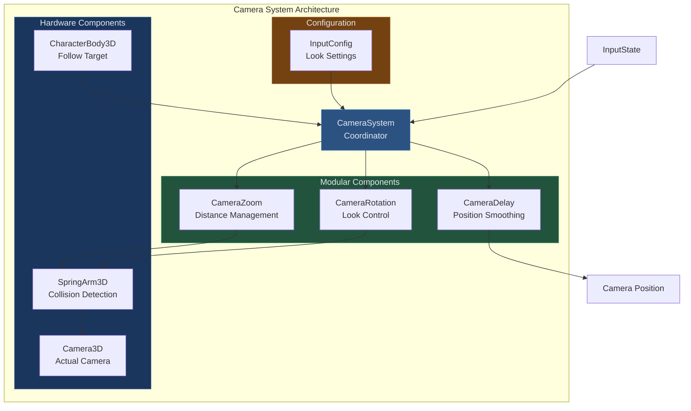
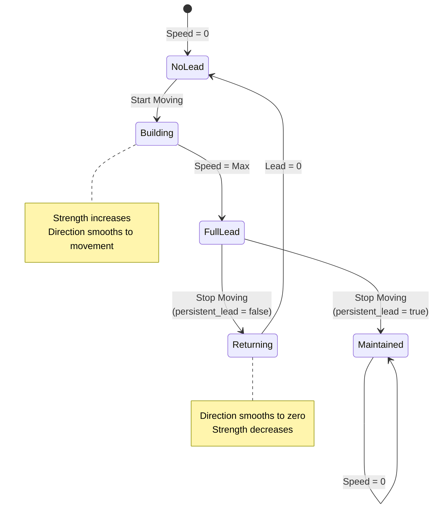
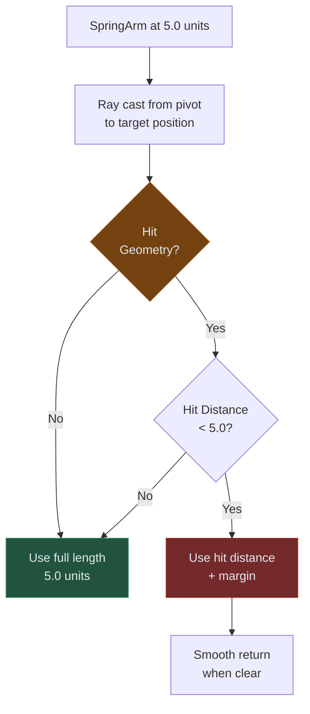
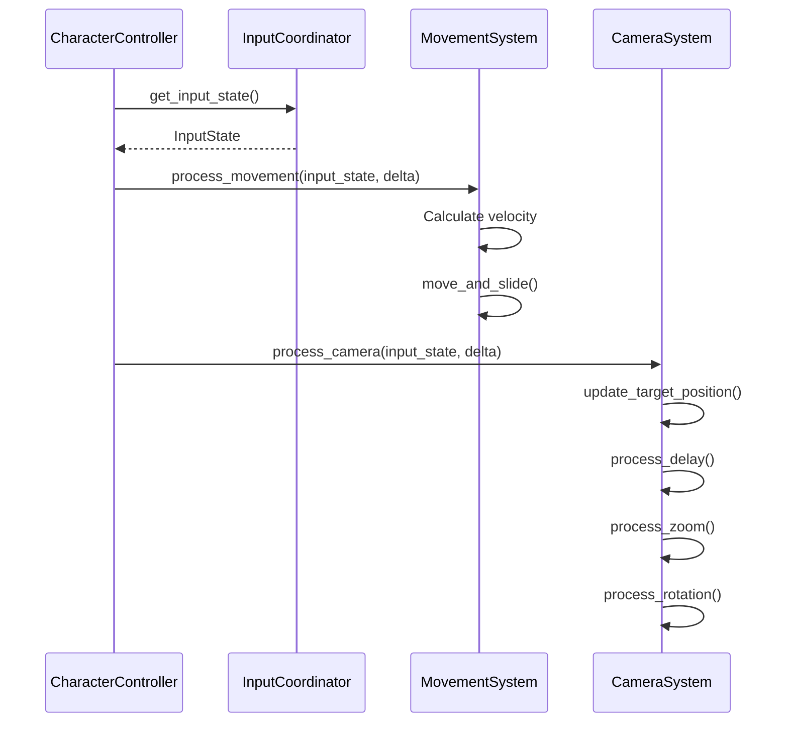
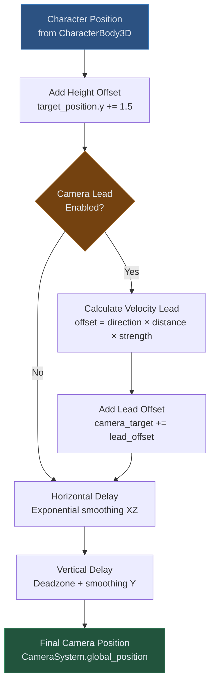

# Camera System Documentation

## Purpose

The Camera System provides smooth third-person camera tracking with modular delay, zoom, and rotation components. It follows character velocity rather than input direction, enabling proper framing during physics interactions, knockback events, and moving platform scenarios.

## Core Philosophy

**Velocity-Based Tracking**: Camera follows actual character movement (velocity) rather than input direction. This ensures proper framing when input and movement diverge (knockback, slopes, moving platforms).

**Modular Component Architecture**: Delay, zoom, and rotation are separate, swappable components. Each operates independently, enabling isolated debugging and feature development.

**Physics-Aware Positioning**: SpringArm3D provides automatic collision detection and distance adjustment, preventing camera from clipping through geometry.

**Lead Target Prediction**: Optional camera lead system positions camera ahead of movement direction, improving forward visibility during high-speed movement.

## Architecture Overview



## Core Components

### CameraSystem (Coordinator)

**Responsibilities**:
- Initialize and coordinate sub-components
- Process InputState for camera control
- Manage target following
- Provide camera space utility methods

**Lifecycle**:
```
_ready()
	↳ configure_spring_arm()
	↳ initialize_camera_position()
	↳ setup_systems()

process_camera(input_state, delta)
	↳ update_target_position()
	↳ process_position_smoothing()  (CameraDelay)
	↳ process_zoom()                (CameraZoom)
	↳ process_rotation()            (CameraRotation)
```

**Key Properties**:
```gdscript
@export var delay_system: CameraDelay
@export var zoom_system: CameraZoom
@export var rotation_system: CameraRotation
@export var spring_arm: SpringArm3D
@export var camera: Camera3D
@export var target_object: CharacterBody3D

@export var camera_height_offset: float = 1.5
@export var camera_distance_offset: float = 2.0
```

### CameraDelay (Position Smoothing)

**Purpose**: Smooth camera following with optional velocity-based lead target.

**Three-Axis System**:
1. **Horizontal (XZ plane)**: Time-based exponential smoothing + optional lead
2. **Vertical (Y axis)**: Time-based smoothing with deadzone gating
3. **Camera Lead**: Velocity-based offset in movement direction

#### Horizontal Delay

**Purpose**: Smooth XZ position changes with configurable delay time.

**Implementation**:
```gdscript
func process_horizontal_delay(target_position, delta):
	var camera_target = target_position  # Start with character position
	
	# Apply camera lead FIRST to get final target
	if enable_camera_lead:
		camera_target = apply_camera_lead(camera_target, movement_direction, delta)
	
	# Smooth to target (lead-adjusted or raw)
	if horizontal_delay_time > 0:
		var lerp_factor = 1.0 - exp(-delta / horizontal_delay_time)
		current_horizontal = current_horizontal.lerp(camera_target, lerp_factor)
	else:
		current_horizontal = camera_target
```

**Exponential Smoothing Formula**:
```
lerp_factor = 1.0 - exp(-delta / delay_time)
```

**Why Exponential?**
- Framerate-independent smoothing
- Asymptotic approach to target (never overshoots)
- Natural deceleration curve

**Typical Value**: 0.3 seconds

#### Vertical Delay

**Purpose**: Smooth Y position with deadzone to prevent camera bobbing.

**Deadzone Gating**:
```gdscript
func process_vertical_delay(target_position, delta):
	var vertical_distance = target_position.y - current_vertical
	
	# Within deadzone → don't move camera
	if abs(vertical_distance) <= vertical_deadzone:
		return
	
	# Outside deadzone → smooth to edge of zone
	var distance_outside_zone = abs(vertical_distance) - vertical_deadzone
	var direction = sign(vertical_distance)
	var target_outside_zone = current_vertical + (direction * distance_outside_zone)
	
	var lerp_factor = 1.0 - exp(-delta / vertical_delay_time)
	current_vertical = lerp(current_vertical, target_outside_zone, lerp_factor)
```

**Deadzone Visualization**:
```
Character Y:     Camera Y:         Result:
              ┌─────────────┐
     2.5  ──> │   Deadzone  │ ──>  No camera movement
              │   (±0.5)    │
     2.0  ──> └─────────────┘      (Camera at 2.0)
              
     1.3  ──> Outside zone  ──>    Camera moves toward 1.8
```

**Typical Values**:
- `vertical_deadzone`: 0.5 units
- `vertical_delay_time`: 0.5 seconds

**Purpose of Deadzone**: Prevents camera from following small jumps, head bob during walking, or minor terrain variations.

#### Camera Lead System

**Purpose**: Position camera ahead of movement direction for better forward visibility.

**Velocity-Based Calculation**:
```gdscript
func apply_camera_lead(camera_target, movement_direction, delta):
	# Get current movement speed
	var current_speed = target_node.get_velocity().length()
	
	# Calculate lead strength (0-1 normalized by max speed)
	var target_lead_strength = clamp(current_speed / max_movement_speed, 0.0, 1.0)
	
	# Smooth strength and direction toward target
	if is_moving:
		current_lead_strength = lerp(current_lead_strength, target_lead_strength, lead_start_multiplier * delta)
		current_lead_direction = current_lead_direction.lerp(movement_direction, lead_start_multiplier * delta)
	elif not persistent_lead:
		current_lead_direction = current_lead_direction.lerp(Vector2.ZERO, lead_end_multiplier * delta)
		current_lead_strength = lerp(current_lead_strength, 0.0, lead_end_multiplier * delta)
	
	# Apply offset
	var direction_offset = Vector3(current_lead_direction.x, 0, current_lead_direction.y)
	direction_offset *= camera_lead_distance * current_lead_strength
	
	return camera_target + direction_offset
```

**Parameters**:
```gdscript
@export var enable_camera_lead: bool = true
@export var camera_lead_distance: float = 1.5        # Maximum offset distance
@export var persistent_lead: bool = true             # Maintain when stopped
@export var max_movement_speed: float = 6.0          # Speed for 100% strength
@export var lead_start_multiplier: float = 8.0       # Speed of lead response
@export var lead_end_multiplier: float = 3.0         # Speed of lead return
```

**Behavior Diagram**:


**Lead Strength Formula**:
```
strength = clamp(current_speed / max_movement_speed, 0.0, 1.0)
offset = movement_direction * camera_lead_distance * strength
```

**Example**:
```
Speed = 0.0   → Strength = 0.0 → Offset = 0.0 units
Speed = 3.0   → Strength = 0.5 → Offset = 0.75 units ahead
Speed = 6.0   → Strength = 1.0 → Offset = 1.5 units ahead
```

### CameraZoom (Distance Management)

**Purpose**: Handle player-controlled zoom and automatic collision-based distance adjustment.

**SpringArm Integration**:
```gdscript
func initialize(spring_arm_ref, distance_offset):
	spring_arm = spring_arm_ref
	target_spring_length = initial_distance + distance_offset
	spring_arm.spring_length = target_spring_length

func process_zoom(zoom_delta, delta):
	var zoom_amount = zoom_delta * zoom_speed
	target_spring_length = clamp(
		target_spring_length - zoom_amount,
		min_distance,
		max_distance
	)

func apply_zoom_smoothing(delta):
	spring_arm.spring_length = lerp(
		spring_arm.spring_length,
		target_spring_length,
		zoom_smoothing * delta
	)
```

**Parameters**:
```gdscript
@export var initial_distance: float = 3.0
@export var min_distance: float = 2.0
@export var max_distance: float = 10.0
@export var zoom_speed: float = 1.0
@export var zoom_smoothing: float = 4.0
```

**SpringArm Collision Behavior**:
```
Desired Distance: 5.0
Wall at 3.0 → SpringArm.spring_length automatically reduces to 3.0
Wall removed → SpringArm.spring_length smoothly returns to 5.0
```

**Why Separate Target and Actual Length?**
- `target_spring_length`: Player's desired zoom level
- `spring_arm.spring_length`: Actual distance (collision-adjusted)
- Collision can override actual, but target persists for smooth return

### CameraRotation (Look Control)

**Purpose**: Handle player look input with smoothing and constraints.

**Rotation System**:
```gdscript
func process_rotation(look_delta, delta):
	# Apply inversion
	var adjusted_delta = look_delta
	if invert_horizontal:
		adjusted_delta.x = -adjusted_delta.x
	if invert_vertical:
		adjusted_delta.y = -adjusted_delta.y
	
	# Update target rotations
	target_horizontal_rotation -= adjusted_delta.x
	target_vertical_rotation -= adjusted_delta.y
	
	# Apply vertical limits
	var vertical_limit = deg_to_rad(input_config.vertical_look_limit)
	target_vertical_rotation = clamp(target_vertical_rotation, -vertical_limit, vertical_limit)
	
	# Smooth to target
	current_horizontal_rotation = lerp_angle(
		current_horizontal_rotation,
		target_horizontal_rotation,
		horizontal_smoothing * delta
	)
	current_vertical_rotation = lerp_angle(
		current_vertical_rotation,
		target_vertical_rotation,
		vertical_smoothing * delta
	)
	
	# Apply to spring arm
	spring_arm.rotation.y = current_horizontal_rotation
	spring_arm.rotation.x = current_vertical_rotation
```

**Why lerp_angle()?**
Handles angle wrapping correctly. Regular lerp fails across -π/π boundary:
```
lerp(-170°, 170°, 0.5) = 0°     (WRONG - short path)
lerp_angle(-170°, 170°, 0.5) = 180°  (CORRECT - wraps properly)
```

**Vertical Look Limits**:
```
  ┌─────────────┐  +80° (looking down)
  │             │
  │   Character │  0° (horizon)
  │             │
  └─────────────┘  -80° (looking up)
```

**Typical Values**:
- `vertical_look_limit`: 80° (prevents camera flipping)
- `horizontal_smoothing`: 6.0 (responsive horizontal)
- `vertical_smoothing`: 12.0 (smoother vertical, reduces motion sickness)

## SpringArm3D Configuration

**Purpose**: Godot's built-in collision-aware camera boom.

**Critical Properties**:
```gdscript
spring_arm.collision_mask = 1     # Only detect environment (Layer 1)
spring_arm.margin = 0.1            # Collision sphere radius
spring_arm.spring_length = 5.0     # Desired distance from pivot
```

**Collision Layer Setup**:
- **Environment**: Layer 1
- **Character**: Layer 2
- **SpringArm Mask**: 1 (only hits environment)

**Why Exclude Character Layer?**
If SpringArm detects character collider, it thinks character is obstacle and snaps camera to character center during movement.

### Collision Response



## Scene Hierarchy

**Required Structure**:
```
CharacterController (Node3D)
├── CameraSystem (Node3D) - Follows character horizontally
│   ├── CameraDelay (Node)
│   ├── CameraZoom (Node)
│   ├── CameraRotation (Node)
│   └── SpringArm3D
│       └── CameraRig (Node3D) - Vertical offset container
│           └── Camera3D
└── CharacterBody3D
```

**Why This Hierarchy?**

1. **CameraSystem Position**: Character position + height offset
2. **SpringArm Rotation**: Player look angles
3. **SpringArm Length**: Zoom distance (collision-adjusted)
4. **CameraRig**: Vertical camera offset without affecting SpringArm
5. **Camera3D**: Actual viewport

**Position Inheritance Flow**:
```
Character (0, 0, 0)
  ↓ + height offset
CameraSystem (0, 1.5, 0)
  ↓ + horizontal/vertical delay
Final Position (0.5, 1.7, -0.3)
  ↓ rotation from SpringArm
SpringArm local space
  ↓ distance from spring_length
CameraRig (0, 0, -5.0) in SpringArm space
  ↓ vertical offset
Camera3D (0, 0.5, -5.0)
```

## Camera Space Utilities

### Direction Calculations

```gdscript
func get_camera_forward() -> Vector3:
	return -camera.global_transform.basis.z.normalized()

func get_camera_right() -> Vector3:
	return camera.global_transform.basis.x.normalized()

func get_camera_up() -> Vector3:
	return camera.global_transform.basis.y.normalized()
```

**Basis Vectors**:
```
      Y (Up)
      │
      │
      └────X (Right)
     ╱
    ╱
   Z (Forward is -Z in Godot!)
```

**Usage in Movement System**:
```gdscript
var camera_dirs = get_camera_directions()
var forward_movement = camera_dirs.forward * input.y
var right_movement = camera_dirs.right * input.x
```

## Processing Flow

### Frame Update Sequence



### Position Update Flow



## Common Issues

### Camera Snapping During Movement

**Symptom**: Camera jumps to character center when moving.

**Cause**: SpringArm3D collision mask includes character layer.

**Fix**:
```gdscript
spring_arm.collision_mask = 1  # Environment only, NOT layer 2 (character)
character_body.collision_layer = 2
```

**Verification**:
```gdscript
# In scene file (.tscn), check:
[node name="SpringArm3D" ...]
collision_mask = 1  # NOT 3 or 2

[node name="CharacterBody3D" ...]
collision_layer = 2
collision_mask = 1
```

### Camera Clipping Through Walls

**Symptom**: Camera phases through geometry.

**Causes**:
1. SpringArm collision mask excludes environment
2. Margin too large
3. Wall has no collision

**Fix**:
```gdscript
spring_arm.collision_mask = 1  # Must include environment layer
spring_arm.margin = 0.1         # Smaller margin
```

Verify wall has CollisionShape3D on Layer 1.

### Camera Bobbing on Flat Ground

**Symptom**: Camera oscillates vertically during movement.

**Cause**: Vertical deadzone too small or disabled.

**Fix**:
```gdscript
# In CameraDelay
vertical_deadzone = 0.5  # Increase deadzone
vertical_delay_time = 0.5  # Increase smoothing
```

### Delayed Camera Response

**Symptom**: Camera lags behind look input.

**Cause**: Smoothing values too low or delay times too high.

**Fix**:
```gdscript
# In CameraRotation
horizontal_smoothing = 15.0  # Higher = more responsive
vertical_smoothing = 20.0

# In CameraDelay
horizontal_delay_time = 0.2  # Lower = less delay
```

### Camera Lead Not Working

**Symptom**: Lead offset not applied during movement.

**Diagnosis**:
```gdscript
# Check movement detection
var movement_direction = get_movement_direction()
print("Movement Direction: ", movement_direction)  # Should be non-zero

# Check lead strength
print("Lead Strength: ", current_lead_strength)  # Should increase with speed

# Check lead enabled
print("Lead Enabled: ", enable_camera_lead)  # Should be true
```

**Common Causes**:
1. `max_movement_speed` set too high (strength never reaches 1.0)
2. `lead_start_multiplier` too low (slow response)
3. Character velocity not accessible (missing `get_velocity()`)

### Scene vs Script Configuration Conflict

**Symptom**: Camera settings don't match script assignments.

**Cause**: Scene file (.tscn) properties override script `_ready()` assignments.

**Example**:
```gdscript
# In CameraSystem._ready()
spring_arm.collision_mask = 1  # Script sets this

# But in CCC_porter.tscn
[node name="SpringArm3D" ...]
collision_mask = 2  # Scene file wins!
```

**Fix**: Set properties in scene file OR don't export them in script.

**Best Practice**: Export properties meant to be scene-configurable, use script initialization for derived/calculated values only.

## Debug Visualization

### Camera Lead Target

**Purpose**: Visualize where camera is targeting, including lead offset.

**Implementation**:
```gdscript
@export var target_visualization: Node3D  # Usually MeshInstance3D

func apply_camera_lead(camera_target, movement_direction, delta):
	# ... calculate lead offset
	
	# Update visualization
	if target_visualization:
		target_visualization.global_position = camera_target
	
	return camera_target
```

**Visual Result**: Small mesh (cone/sphere) shows actual camera target, distinct from character position.

### Console Debug

```gdscript
func _process(delta):
	print("Camera Lead Strength: %.2f" % current_lead_strength)
	print("Lead Direction: (%.2f, %.2f)" % [current_lead_direction.x, current_lead_direction.y])
	print("Horizontal Smoothing: %s" % is_horizontal_smoothing)
	print("Vertical Smoothing: %s" % is_vertical_smoothing)
```

## Performance Considerations

### Collision Casting

SpringArm3D ray casts every frame. Optimize by:
- Minimal collision layers (only environment)
- Appropriate `max_results` (default is fine)
- Disable SpringArm if camera not active

### Smoothing Calculations

Exponential smoothing is cheap (one exp() call per axis per frame). No optimization needed unless running hundreds of cameras.

### Vector Operations

```gdscript
# Cache camera basis vectors if used multiple times per frame
var camera_dirs = get_camera_directions()  # Do once
# Use camera_dirs.forward multiple times

# Avoid:
get_camera_forward()  # Called 5 times = 5 calculations
```

## Extension Examples

### Orbit Camera Mode

```gdscript
# Add to CameraSystem
var orbit_mode: bool = false
@export var orbit_speed: float = 2.0

func process_orbit_camera(input_state, delta):
	if orbit_mode:
		# Auto-rotate around character
		rotation_system.target_horizontal_rotation += orbit_speed * delta
		# Disable manual rotation input
		return  # Skip normal rotation processing
```

### Look-At Target

```gdscript
# Add to CameraRotation
var look_at_target: Node3D = null

func process_rotation(look_delta, delta):
	if look_at_target:
		# Calculate angle to target
		var to_target = look_at_target.global_position - camera.global_position
		var horizontal_angle = atan2(to_target.x, to_target.z)
		var vertical_angle = atan2(to_target.y, Vector2(to_target.x, to_target.z).length())
		
		# Smooth to target angles
		target_horizontal_rotation = horizontal_angle
		target_vertical_rotation = vertical_angle
		# Continue with normal smoothing
	else:
		# Normal input-based rotation
```

### Shake Effect

```gdscript
# Add to CameraSystem
var shake_strength: float = 0.0
var shake_decay: float = 5.0

func apply_camera_shake(strength: float):
	shake_strength = strength

func process_camera(input_state, delta):
	# ... normal camera processing
	
	# Add shake offset
	if shake_strength > 0:
		var shake_offset = Vector3(
			randf_range(-shake_strength, shake_strength),
			randf_range(-shake_strength, shake_strength),
			0
		)
		camera.transform.origin += shake_offset
		shake_strength = max(0, shake_strength - shake_decay * delta)
```

### Adjustable FOV

```gdscript
# Add to CameraZoom
@export var fov_min: float = 60.0
@export var fov_max: float = 90.0
@export var fov_zoom_influence: float = 0.5

func apply_zoom_smoothing(delta):
	# ... normal zoom smoothing
	
	# Adjust FOV based on distance
	var zoom_ratio = (spring_arm.spring_length - min_distance) / (max_distance - min_distance)
	var target_fov = lerp(fov_min, fov_max, zoom_ratio * fov_zoom_influence)
	camera.fov = lerp(camera.fov, target_fov, zoom_smoothing * delta)
```

## Testing Camera System

**Unit Tests**:
- Exponential smoothing formula correctness
- Vertical deadzone gating logic
- Lead strength calculation
- Rotation angle wrapping

**Integration Tests**:
- SpringArm collision response
- Component initialization order
- Configuration propagation
- Input → rotation conversion

**Manual Tests**:
- Walk toward wall (collision distance adjustment)
- Jump/land (vertical deadzone behavior)
- Sprint (lead target positioning)
- Rotate camera 360° (no gimbal lock)
- Scene property override (config persistence)

## Critical Implementation Notes

**Initialize Components in Correct Order**:
```gdscript
func _ready():
	configure_spring_arm()      # 1. Hardware setup
	initialize_camera_position()  # 2. Initial position
	setup_systems()             # 3. Component initialization (requires position)
```

**Always Read Target Position from CharacterBody3D**:
```gdscript
# WRONG - cached position becomes stale
var target_pos = target_object.global_position  # Cached in _ready()

# RIGHT - read fresh position every frame
func update_target_position():
	var new_target = target_object.global_position  # Fresh every frame
```

**Clear Input After Rotation Processing**:
InputState.look_delta is frame data - must be cleared by InputCoordinator after camera processes it, or rotation accumulates.

**Use lerp_angle() for Rotations**:
```gdscript
# WRONG - breaks at angle boundaries
rotation.y = lerp(rotation.y, target, smoothing * delta)

# RIGHT - handles wrapping
rotation.y = lerp_angle(rotation.y, target, smoothing * delta)
```

**SpringArm Collision Mask Must Exclude Character**:
```gdscript
# Character
collision_layer = 2  # Character layer
collision_mask = 1   # Detects environment

# SpringArm
collision_mask = 1   # Detects environment, NOT character (not 3!)
```