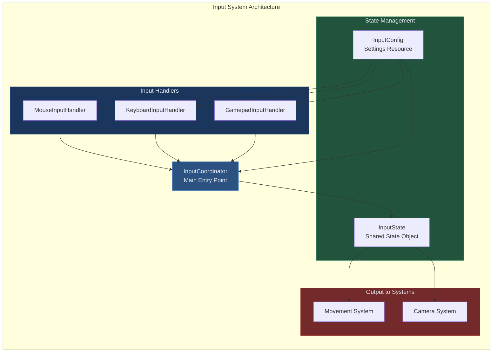
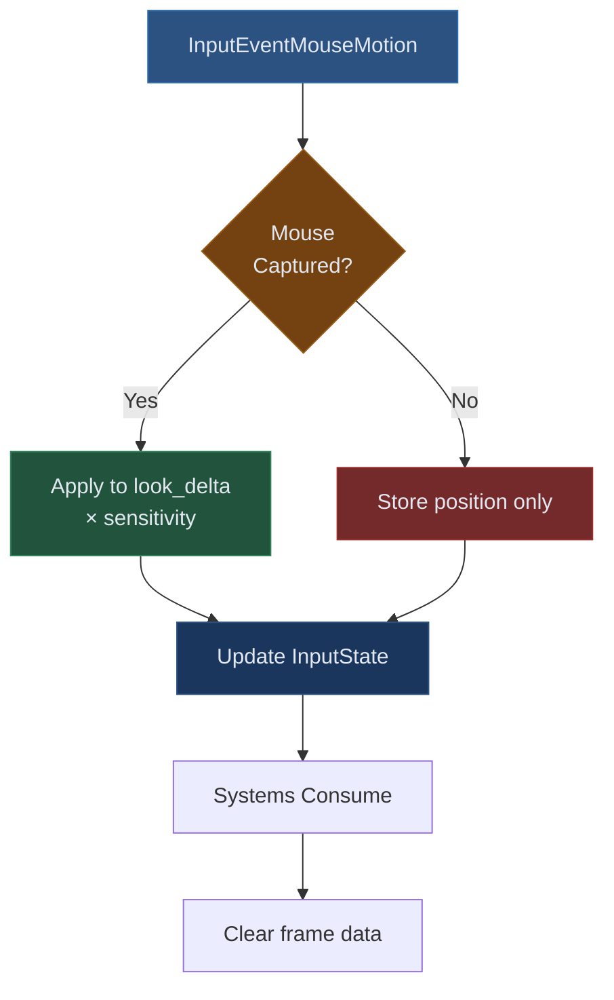
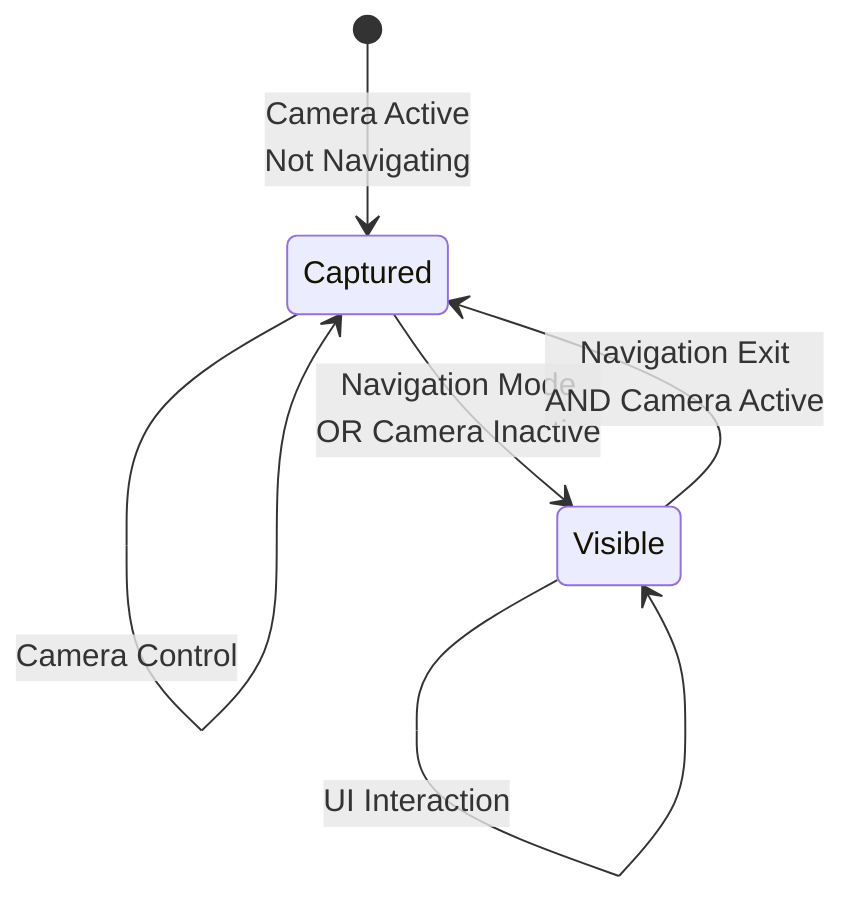

# Input System Documentation

## Purpose

The Input System aggregates input from multiple devices (keyboard, mouse, gamepad) into a unified state object consumed by Movement and Camera systems. It handles device switching, sensitivity scaling, deadzone application, and mouse capture management.

## Architecture Overview



## Core Components

### InputCoordinator

**Responsibilities**:
- Aggregate input from all handlers
- Manage mouse capture state
- Provide unified InputState to consumers
- Handle frame data cleanup

**Lifecycle**:
```
_ready() → Initialize handlers with InputConfig
_input(event) → Route event to appropriate handler
_process(delta) → Update continuous input + cleanup
```

**Key Methods**:
- `get_input_state()`: Returns current frame state + clears frame data
- `update_mouse_capture()`: Syncs mouse mode with camera/navigation state
- `set_camera_active(bool)`: Control camera input processing

### MouseInputHandler

**Processes**:
- Mouse motion → Look delta
- Mouse buttons → Navigation/action triggers
- Mouse wheel → Zoom delta
- Screen position tracking

**Critical Behavior**: Mouse delta only contributes to look_delta when mouse is captured (camera active, not in navigation mode).

**Implementation**:
```gdscript
func process_input(event, input_state):
	if event is InputEventMouseMotion:
		input_state.mouse_screen_position = event.position
		if mouse_captured:
			input_state.look_delta += event.relative * sensitivity
```

### KeyboardInputHandler

**Processes**:
- WASD/Arrow keys → Movement vector
- Space → Jump
- Shift → Sprint
- Ctrl → Walk
- Action mappings via InputMap

**Key Feature**: Uses action names not scancodes, allowing remapping without code changes.

### GamepadInputHandler

**Processes**:
- Left stick → Movement vector
- Right stick → Look delta
- Button mappings → Jump/sprint/walk
- Deadzone application

**Deadzone Logic**:
```
if abs(stick_value) < deadzone:
	stick_value = 0
else:
	rescale to [0,1] range
```

## InputState Object

**Purpose**: Single-frame snapshot of all user input. Consumed by Movement/Camera systems then cleared.

### Data Structure

```gdscript
class_name InputState

# Movement
var movement: Vector2 = Vector2.ZERO
var sprint_pressed: bool = false
var walk_pressed: bool = false

# Camera/Look
var look_delta: Vector2 = Vector2.ZERO
var zoom_delta: float = 0.0

# Jump
var jump_pressed: bool = false
var jump_held: bool = false
var jump_just_pressed: bool = false

# Input Source
enum InputSource { KEYBOARD_MOUSE, GAMEPAD }
var current_input_source: InputSource = KEYBOARD_MOUSE
```

### Frame vs Persistent Data

**Frame Data** (cleared every frame):
- look_delta
- jump_pressed
- jump_just_pressed
- zoom_delta

**Persistent Data** (retained until state changes):
- sprint_pressed
- walk_pressed
- jump_held
- movement

**Why This Matters**: Frame data accumulates during _input() calls. If not cleared, look_delta compounds causing camera to spin uncontrollably.

### Helper Methods

```gdscript
func has_movement() -> bool:
	return movement.length() > 0.0

func has_look() -> bool:
	return look_delta.length() > 0.0

func get_final_movement() -> Vector2:
	# Returns navigation or player movement
	if is_navigating:
		return navigation_movement
	return movement
```

## InputConfig Resource

**Purpose**: Designer-facing configuration for input sensitivity, deadzones, smoothing.

### Configuration Structure

```gdscript
class_name InputConfig extends Resource

# Mouse
@export var mouse_sensitivity: Vector2 = Vector2(0.002, 0.002)
@export var invert_y: bool = false

# Gamepad
@export var gamepad_look_sensitivity: Vector2 = Vector2(0.3, 0.15)
@export var left_stick_deadzone: float = 0.1
@export var right_stick_deadzone: float = 0.1

# Camera
@export var vertical_look_limit: float = 80.0
@export var horizontal_smoothing: float = 10.0
@export var vertical_smoothing: float = 10.0
```

**Usage**: Create `.tres` resource file, assign to CharacterController, automatically shared with all input handlers.

## Input Flow Diagrams

### Mouse Input Processing



### Gamepad Input Processing

```mermaid
flowchart TD
    Stick[Analog Stick Input]
    
    Stick --> Dead{Value ><br/>Deadzone?}
    
    Dead -->|No| Zero[Set to Zero]
    Dead -->|Yes| Scale[Rescale to [0,1]]
    
    Scale --> Sens[Apply Sensitivity]
    Zero --> State[Update InputState]
    Sens --> State
    
    State --> Source[Set Input Source<br/>to GAMEPAD]
    Source --> Systems[Systems Consume]
    
    style Stick fill:#2c5282,stroke:#2b6cb0,color:#e2e8f0
    style Dead fill:#744210,stroke:#975a16,color:#e2e8f0
    style Scale fill:#22543d,stroke:#2f855a,color:#e2e8f0
    style Sens fill:#1a365d,stroke:#2c5282,color:#e2e8f0
```

## Device Switching

### Automatic Detection

**Mechanism**: Each handler sets `input_state.current_input_source` when processing input. Last active device wins.

**Implementation**:
```gdscript
# In MouseInputHandler
func process_input(event, input_state):
	input_state.current_input_source = InputState.InputSource.KEYBOARD_MOUSE
	# ... process input

# In GamepadInputHandler
func process_input(event, input_state):
	input_state.current_input_source = InputState.InputSource.GAMEPAD
	# ... process input
```

**Consumption**: Movement/Camera systems check `input_state.current_input_source` to apply device-specific multipliers from MovementConfig.

### Why Per-Device Multipliers?

Gamepads and mouse have different input characteristics:
- **Mouse**: Precise, high-resolution delta values
- **Gamepad**: Continuous analog values, require scaling

MovementConfig provides separate multipliers:
```gdscript
@export var gamepad_movement_multiplier: float = 1.0
@export var gamepad_acceleration_multiplier: float = 1.2
@export var gamepad_rotation_speed_multiplier: float = 1.1
```

Movement system applies appropriate multiplier:
```gdscript
func get_movement_speed(input_source: InputSource) -> float:
	var base_speed = run_speed
	if input_source == InputSource.GAMEPAD:
		return base_speed * gamepad_movement_multiplier
	return base_speed
```

## Mouse Capture Management

### States

**Captured** (MOUSE_MODE_CAPTURED):
- Mouse hidden
- Mouse confined to window
- Movement generates look_delta
- Used during camera control

**Visible** (MOUSE_MODE_VISIBLE):
- Mouse visible
- Free movement
- Position tracked for navigation
- Used during UI interaction

### State Transitions



### Implementation

```gdscript
func update_mouse_capture():
	var should_capture = camera_active and not navigation_mode
	mouse_handler.set_mouse_captured(should_capture)

func set_mouse_captured(captured: bool):
	mouse_captured = captured
	Input.mouse_mode = Input.MOUSE_MODE_CAPTURED if captured else Input.MOUSE_MODE_VISIBLE
```

## Action Mapping

### Default Action Map

```
Movement:
- move_forward: W, Up
- move_back: S, Down
- move_left: A, Left
- move_right: D, Right

Actions:
- jump: Space, Gamepad Button 0 (A/Cross)
- sprint: Shift, Gamepad Button 10 (L3)
- walk: Ctrl, Gamepad Button 11 (R3)

Camera:
- mouse_wheel_up: Mouse Wheel Up
- mouse_wheel_down: Mouse Wheel Down

Navigation:
- primary_action: Mouse Left
- secondary_action: Mouse Right
```

### Customization

Actions defined in Project Settings → Input Map. Handlers use action names:

```gdscript
func update_movement_input(input_state):
	var forward = Input.get_action_strength("move_forward")
	var back = Input.get_action_strength("move_back")
	var left = Input.get_action_strength("move_left")
	var right = Input.get_action_strength("move_right")
	
	input_state.movement = Vector2(right - left, forward - back)
```

## Debugging Input Issues

### No Movement Detected

**Check**:
1. Action names match InputMap
2. InputCoordinator receiving _input events
3. Handler `process_input()` being called
4. InputState.movement non-zero after keyboard update
5. Movement system receiving InputState

### Camera Not Rotating

**Check**:
1. Mouse captured (camera_active && !navigation_mode)
2. Mouse sensitivity non-zero
3. look_delta accumulating during mouse motion
4. Camera system processing InputState
5. Frame data not being cleared prematurely

### Gamepad Not Responding

**Check**:
1. Gamepad connected (OS level)
2. Deadzone not too high (0.1-0.2 typical)
3. Sensitivity scaling appropriate
4. Input source switching to GAMEPAD
5. Action map includes gamepad bindings

### Input Lag/Stutter

**Causes**:
- Processing in _physics_process() instead of _process()
- Heavy computation in input handlers
- Multiple InputState copies per frame
- Missing frame data cleanup

**Solution**: Use _process() for input, minimize handler logic, clear frame data after system consumption.

## Extension Examples

### Adding Touch Input

```gdscript
class_name TouchInputHandler extends RefCounted

var input_config: InputConfig
var touch_start: Vector2 = Vector2.ZERO
var is_touching: bool = false

func _init(config: InputConfig):
	input_config = config

func process_input(event, input_state):
	if event is InputEventScreenTouch:
		if event.pressed:
			touch_start = event.position
			is_touching = true
		else:
			is_touching = false
	
	if event is InputEventScreenDrag and is_touching:
		var delta = event.position - touch_start
		input_state.look_delta += delta * input_config.mouse_sensitivity
		touch_start = event.position
		input_state.current_input_source = InputState.InputSource.TOUCH
```

Register in InputCoordinator:
```gdscript
var touch_handler: TouchInputHandler

func _ready():
	touch_handler = TouchInputHandler.new(input_config)

func _input(event):
	if event is InputEventScreenTouch or event is InputEventScreenDrag:
		touch_handler.process_input(event, cached_input_state)
```

### Custom Input Modifier

```gdscript
# Add to InputState
var precision_mode: bool = false

# Add to KeyboardInputHandler
func update_movement_input(input_state):
	# ... existing movement code
	
	input_state.precision_mode = Input.is_action_pressed("precision_modifier")

# Consume in MovementSystem
func calculate_hybrid_ground_movement(input_state, delta):
	var base_speed = movement_config.get_movement_speed(input_state.current_input_source)
	
	if input_state.precision_mode:
		base_speed *= 0.5  # Half speed in precision mode
	
	# ... continue movement calculation
```

## Performance Considerations

**Handler Count**: O(n) where n = number of handlers. Minimize handler count, not complexity.

**InputState Copying**: Each `get_input_state()` creates copy. Call once per frame, pass reference to systems.

**Action Polling**: `Input.is_action_pressed()` is fast (hash lookup). Prefer over manual key checking.

**Event Filtering**: Route events to correct handler immediately. Avoid checking all handlers for every event.

## Critical Implementation Notes

**Clear Frame Data After Consumption**:
```gdscript
func process_input_reactions(input_state):
	# Systems have consumed input
	cached_input_state.clear_frame_data()
```

**Update Mouse Position Continuously**:
```gdscript
func _process(delta):
	# Update position even when not captured for navigation
	if not mouse_handler.mouse_captured:
		cached_input_state.mouse_screen_position = get_viewport().get_mouse_position()
```

**Set Input Source in Every Update**:
```gdscript
# WRONG - source not updated
func process_input(event, input_state):
	input_state.look_delta += event.relative

# RIGHT - source always set
func process_input(event, input_state):
	input_state.look_delta += event.relative
	input_state.current_input_source = InputState.InputSource.KEYBOARD_MOUSE
```

**Initialize Handlers in _ready()**:
```gdscript
func _ready():
	# All handlers need InputConfig
	if not input_config:
		input_config = InputConfig.new()
	
	mouse_handler = MouseInputHandler.new(input_config)
	keyboard_handler = KeyboardInputHandler.new(input_config)
	gamepad_handler = GamepadInputHandler.new(input_config)
```

## Testing Input System

**Unit Tests**:
- Handler processes correct event types
- Deadzone applied correctly
- Sensitivity scaling works
- Frame data clears properly

**Integration Tests**:
- InputCoordinator routes events correctly
- InputState updates from multiple handlers
- Device switching functions
- Mouse capture transitions work

**Manual Testing**:
- Print InputState values in _process()
- Verify device multipliers apply
- Test action remapping
- Validate navigation mode transitions