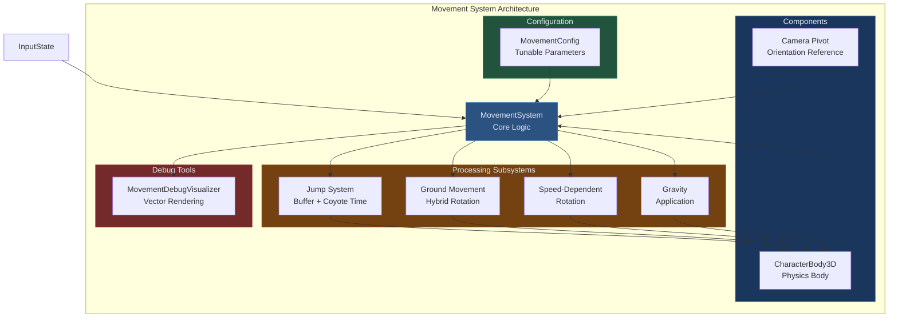
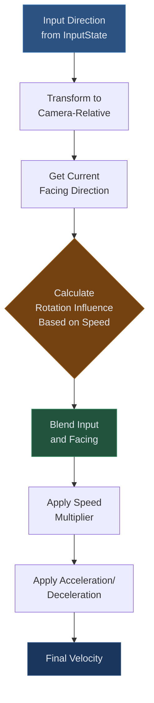
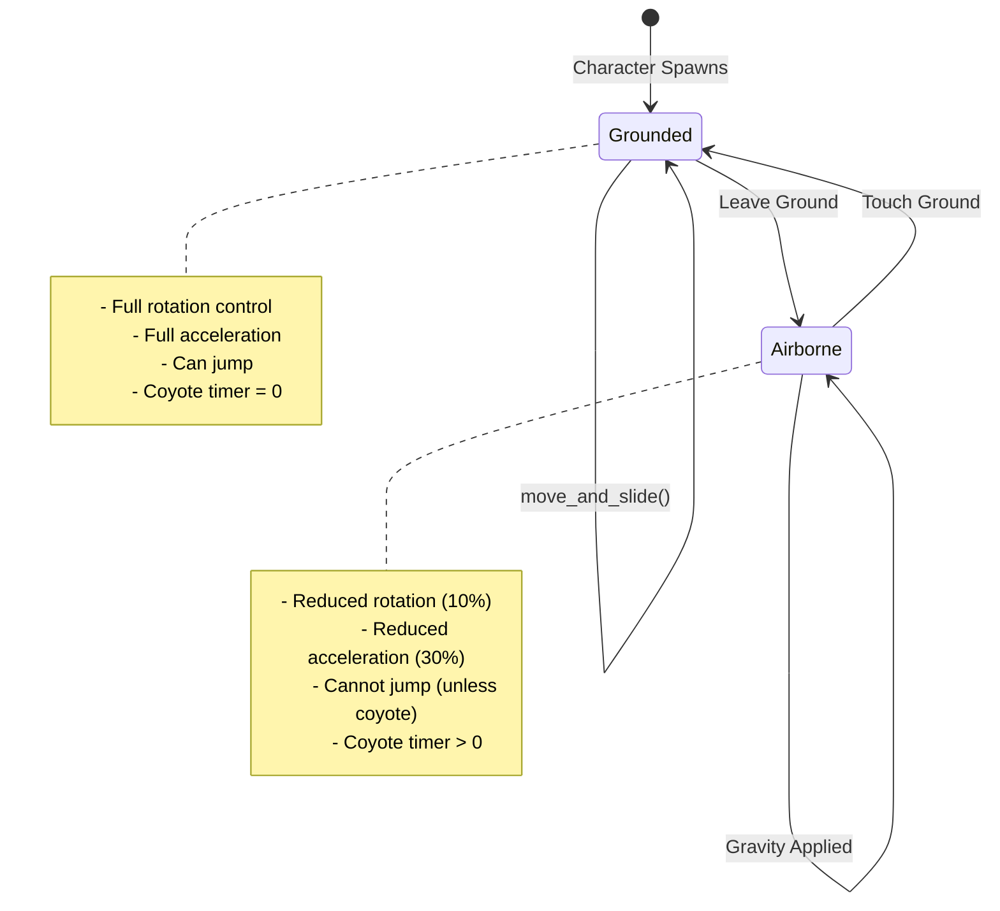
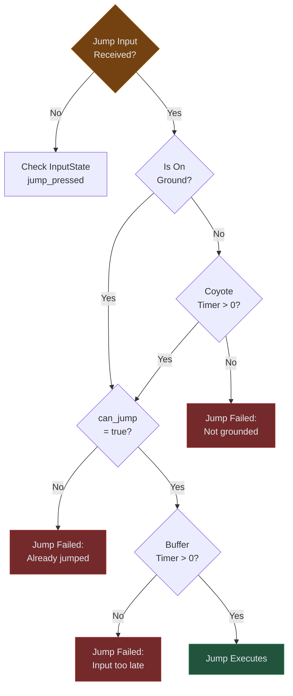

# Movement System Documentation

## Purpose

The Movement System converts InputState into character motion using hybrid rotation/velocity mechanics. It balances responsive arcade-style control at low speeds with momentum-based physics at high speeds, creating natural-feeling character movement that works with Godot's physics engine.

## Core Philosophy

**Hybrid Movement Model**: Character rotation and velocity are calculated separately then combined. At low speeds, rotation follows input directly (arcade). At high speeds, rotation influence decreases while velocity maintains momentum (physics-based).

**Camera-Relative Control**: Input direction transformed relative to camera orientation, not world axes. Pressing forward moves toward camera view direction.

**Speed-Dependent Turning**: Rotation speed decreases with velocity. Sharp turns at full sprint feel heavy; tight maneuvers at low speed feel responsive.

**Physics Integration**: Uses CharacterBody3D.move_and_slide() for ground detection, slope handling, and collision response. Movement system focuses on velocity calculation, physics engine handles execution.

## Architecture Overview



## Core Components

### MovementSystem

**Responsibilities**:
- Process InputState each frame
- Calculate hybrid rotation + velocity
- Apply gravity and physics
- Manage jump mechanics
- Expose debug data

**Lifecycle**:
```
_ready() → Validate MovementConfig
process_movement(input_state, delta) → Main update loop
	↳ update_movement_timers()
	↳ update_ground_state()
	↳ process_jump_input()
	↳ calculate_hybrid_ground_movement()
	↳ calculate_speed_dependent_rotation()
	↳ apply_gravity()
	↳ move_and_slide()
```

### MovementConfig Resource

**Purpose**: All tunable movement parameters in designer-friendly format.

**Configuration Structure**:
```gdscript
@export_group("Movement Speeds")
@export var walk_speed: float = 1.3
@export var run_speed: float = 3.0
@export var sprint_speed: float = 6.3

@export_group("Movement Physics")
@export var acceleration: float = 30.0
@export var deceleration: float = 10.0
@export var air_direction_control: float = 0.3
@export var air_rotation_control: float = 0.1

@export_group("Jump Settings")
@export var jump_height: float = 1.5
@export var gravity: float = -20.0
@export var coyote_time: float = 0.15
@export var jump_buffer_time: float = 0.1

@export_group("Rotation")
@export var rotation_speed: float = 8.0
@export var min_rotation_speed: float = 0.1
@export var speed_rotation_reduction: float = 0.7

@export_group("Movement Feel")
@export var max_rotation_influence: float = 1.0
@export var rotation_influence_start_speed: float = 2.0
@export var rotation_influence_curve: float = 1.0
@export var momentum_rotation_bonus: float = 0.2
```

## Movement Mechanics

### Hybrid Rotation/Velocity System

**Problem**: Pure input-based movement feels arcade-like but doesn't preserve momentum. Pure velocity-based movement feels sluggish and unresponsive.

**Solution**: Blend between two movement vectors based on speed.

#### Movement Calculation Flow



#### Rotation Influence Formula

**Purpose**: Determine how much current facing direction affects movement direction.

**Implementation**:
```gdscript
func get_rotation_influence_factor(current_speed: float, has_momentum: bool = false) -> float:
	# No influence below threshold speed
	if current_speed < rotation_influence_start_speed:
		return 0.0
	
	# Calculate normalized speed above threshold
	var speed_above_threshold = current_speed - rotation_influence_start_speed
	var max_speed_range = sprint_speed - rotation_influence_start_speed
	var speed_ratio = clamp(speed_above_threshold / max_speed_range, 0.0, 1.0)
	
	# Apply curve to speed ratio
	var curved_ratio = pow(speed_ratio, rotation_influence_curve)
	var base_influence = curved_ratio * max_rotation_influence
	
	# Bonus if maintaining momentum
	if has_momentum:
		base_influence += momentum_rotation_bonus
	
	return clamp(base_influence, 0.0, 1.0)
```

**Parameters**:
- **rotation_influence_start_speed**: Speed where influence begins (typically run speed)
- **max_rotation_influence**: Maximum influence at full speed (0.0-1.0)
- **rotation_influence_curve**: Exponential curve (1.0 = linear, >1.0 = delayed onset)
- **momentum_rotation_bonus**: Extra influence when maintaining direction

**Example Values**:
```
Speed = 1.5 (below threshold 2.0) → Influence = 0.0 (pure input control)
Speed = 4.0 (mid-range) → Influence = 0.47 (blend)
Speed = 6.3 (sprint) → Influence = 1.0 (pure momentum)
Speed = 6.3 + maintaining momentum → Influence = 1.0 + 0.2 bonus
```

#### Direction Blending

```gdscript
var input_direction = get_camera_relative_movement(input_state.movement)
var facing_direction = Vector2(sin(current_rotation), cos(current_rotation))

var blended_direction: Vector2
if current_rotation_influence > 0.0:
	blended_direction = input_direction.lerp(facing_direction, current_rotation_influence)
	blended_direction = blended_direction.normalized()
else:
	blended_direction = input_direction
```

**Behavior**:
- Influence = 0.0 → Movement follows input exactly (arcade)
- Influence = 0.5 → Movement is average of input and facing (blend)
- Influence = 1.0 → Movement follows facing exactly (momentum)

#### Momentum Detection

**Purpose**: Detect when player maintains direction to reward sustained movement.

**Implementation**:
```gdscript
var direction_similarity = previous_input_direction.dot(input_direction)
is_maintaining_momentum = (
	direction_similarity > direction_change_threshold and
	horizontal_speed > movement_config.rotation_influence_start_speed
)
```

**Parameters**:
- **direction_change_threshold**: Minimum dot product to count as "same direction" (0.8 typical)

**Effect**: Adds momentum_rotation_bonus to rotation influence, making momentum even harder to break once established.

### Camera-Relative Movement

**Purpose**: Transform input coordinates from screen space to world space relative to camera orientation.

**Implementation**:
```gdscript
func get_camera_relative_movement(input: Vector2) -> Vector2:
	if input.length() == 0:
		return Vector2.ZERO
	
	# Get camera basis vectors (flattened to ground plane)
	var forward = -camera_pivot.global_transform.basis.z
	forward.y = 0
	forward = forward.normalized()
	
	var right = camera_pivot.global_transform.basis.x
	right.y = 0
	right = right.normalized()
	
	# Combine input with camera orientation
	var forward_movement = forward * input.y
	var right_movement = right * input.x
	var movement_3d = forward_movement + right_movement
	
	# Return as 2D vector (XZ plane)
	return Vector2(movement_3d.x, movement_3d.z).normalized()
```

**Coordinate Transform**:
```
Input Space (Screen):        Camera Space (World):
  Y (Forward)                  -Z (Camera Forward)
  |                            |
  |___X (Right)          Y _____|___ X (Camera Right)
                              /
                             /
                            Z (Up in World)
```

### Speed-Dependent Rotation

**Purpose**: Reduce turn speed at high velocity, creating natural-feeling momentum.

**Formula**:
```gdscript
func get_speed_dependent_rotation_speed(current_speed: float, max_speed: float) -> float:
	var speed_ratio = clamp(current_speed / max_speed, 0.0, 1.0)
	var rotation_multiplier = lerp(
		1.0,
		min_rotation_speed / rotation_speed,
		speed_ratio * speed_rotation_reduction
	)
	return rotation_speed * rotation_multiplier
```

**Parameters**:
- **rotation_speed**: Base turn speed at zero velocity (rad/sec)
- **min_rotation_speed**: Minimum turn speed at max velocity
- **speed_rotation_reduction**: Curve steepness (0.0-1.0)

**Example Behavior**:
```
Speed = 0.0 → Turn Speed = 8.0 rad/sec (instant turning)
Speed = 3.0 (half sprint) → Turn Speed = 4.55 rad/sec
Speed = 6.3 (sprint) → Turn Speed = 2.66 rad/sec (wide turns)
```

**Application**:
```gdscript
current_turn_speed = movement_config.get_speed_dependent_rotation_speed(
	horizontal_speed,
	movement_config.sprint_speed
)

current_rotation = lerp_angle(
	current_rotation,
	target_angle,
	current_turn_speed * delta
)
```

### Jump Mechanics

#### Coyote Time

**Purpose**: Grace period after leaving ground where jump still executes. Prevents "missed" jumps from timing precision.

**Implementation**:
```gdscript
# When leaving ground, start timer
if was_on_ground and not is_on_ground:
	coyote_timer = movement_config.coyote_time

# Allow jump during coyote window
var can_coyote_jump = coyote_timer > 0.0
if jump_requested and can_jump and (is_on_ground or can_coyote_jump):
	current_velocity.y = movement_config.jump_velocity
	can_jump = false
	coyote_timer = 0.0
```

**Typical Value**: 0.15 seconds (9 frames at 60fps)

#### Jump Buffering

**Purpose**: Input window before landing where jump request persists. Allows early jump press.

**Implementation**:
```gdscript
# When jump pressed, start buffer timer
if input_state.jump_pressed:
	jump_buffer_timer = movement_config.jump_buffer_time
	jump_requested = true

# Execute jump if buffer active when landing
var can_buffer_jump = jump_buffer_timer > 0.0
if jump_requested and can_buffer_jump and is_on_ground:
	current_velocity.y = movement_config.jump_velocity
	jump_buffer_timer = 0.0
```

**Typical Value**: 0.1 seconds (6 frames at 60fps)

#### Jump Velocity Calculation

**Purpose**: Calculate vertical velocity to reach desired jump height.

**Physics Formula**: `v = sqrt(-2 * g * h)`

**Implementation**:
```gdscript
func calculate_jump_velocity():
	if gravity < 0:
		jump_velocity = sqrt(-2.0 * gravity * jump_height)
```

**Example**:
```
gravity = -20.0
jump_height = 1.5
jump_velocity = sqrt(-2 * -20 * 1.5) = sqrt(60) = 7.746
```

### Gravity Application

**Implementation**:
```gdscript
func apply_gravity(delta: float):
	if not is_on_ground:
		current_velocity.y += movement_config.gravity * delta
	elif is_on_ground and current_velocity.y < 0:
		current_velocity.y = 0
```

**Behavior**:
- In air → Accumulate downward velocity
- On ground with negative velocity → Zero vertical velocity (prevent sinking)

### Air Control

**Purpose**: Reduce directional control and rotation speed while airborne.

**Parameters**:
```gdscript
@export var air_direction_control: float = 0.3  # 30% of ground acceleration
@export var air_rotation_control: float = 0.1   # 10% of ground rotation
```

**Implementation**:
```gdscript
var accel_rate = movement_config.get_acceleration(input_state.current_input_source)
if not is_on_ground:
	accel_rate *= movement_config.air_direction_control

current_turn_speed = movement_config.get_speed_dependent_rotation_speed(...)
if not is_on_ground:
	current_turn_speed *= movement_config.air_rotation_control
```

**Effect**: Prevents mid-air direction changes that violate physics expectations.

## State Machine

### Ground State Tracking



**State Detection**:
```gdscript
func update_ground_state():
	was_on_ground = is_on_ground
	is_on_ground = character_body.is_on_floor()
	
	if is_on_ground and not was_on_ground:
		can_jump = true  # Reset jump permission on landing
```

## Speed Tiers

### Speed Definitions

```
Walk:   1.3 m/s  (modifier: Ctrl key)
Run:    3.0 m/s  (default)
Sprint: 6.3 m/s  (modifier: Shift key)
```

### Speed Transitions

**Smoothed Multiplier System**:
```gdscript
var base_speed = movement_config.get_movement_speed(input_state.current_input_source)

var target_multiplier: float = 1.0
if input_state.sprint_pressed:
	target_multiplier = movement_config.sprint_speed / base_speed
elif input_state.walk_pressed:
	target_multiplier = movement_config.walk_speed / base_speed

smoothed_speed_multiplier = move_toward(
	smoothed_speed_multiplier,
	target_multiplier,
	movement_config.speed_transition_rate * delta
)

var final_speed = base_speed * smoothed_speed_multiplier
```

**Why Smoothing?**
Prevents instant speed changes when pressing/releasing modifiers. Creates natural acceleration/deceleration feel.

**Typical Transition Rate**: 4.0 (units/second)

## Physics Integration

### CharacterBody3D Configuration

**Critical Properties**:
```gdscript
character_body.slide_on_ceiling = false
character_body.floor_stop_on_slope = true
character_body.floor_block_on_wall = true
character_body.floor_snap_length = 0.1
character_body.floor_max_angle = deg_to_rad(45.0)
```

**Collision Layers**:
```gdscript
character_body.collision_layer = 2  # Character layer
character_body.collision_mask = 1   # Detects environment layer
```

### move_and_slide() Behavior

**Execution**:
```gdscript
character_body.velocity = current_velocity
character_body.move_and_slide()
current_velocity = character_body.velocity  # CRITICAL: Read post-slide velocity
```

**Post-Slide Velocity Changes**:
- Collision → Velocity component zeroed
- Slope → Velocity redirected along surface
- Ceiling → Upward velocity clamped
- Floor → Velocity maintained/redirected

**Why Read Back Velocity?**
Physics engine modifies velocity during slide. Ignoring post-slide velocity causes accumulating velocity errors.

### Slope Handling

CharacterBody3D handles slopes automatically via `floor_max_angle`. Movement system treats slopes as ground if angle < 45°.

**Flat Ground**:
```
Velocity: (5, 0, 0)
Result: Moves horizontally
```

**30° Slope**:
```
Velocity: (5, 0, 0)
Result: Redirected along slope surface
Ground Detection: TRUE
```

**60° Slope**:
```
Velocity: (5, 0, 0)
Result: Slides down, not considered walkable
Ground Detection: FALSE
```

## Debug System

### MovementDebugVisualizer

**Purpose**: Real-time visualization of movement vectors and state data.

**Vectors Rendered**:
- **Yellow**: Input direction (raw camera-relative input)
- **Red**: Facing direction (current character rotation)
- **Green**: Blended direction (result of input+facing blend)
- **Blue**: Velocity direction (actual movement)

**Console Debug Output**:
```
====================
Input Direction: (0.71, 0.71)
Facing Direction: (0.50, 0.87)
Blended Direction: (0.61, 0.79)
Velocity Direction: (0.63, 0.77)
Rotation Influence: 35%
Maintaining Momentum: YES
Speed: 4.25
Turn Speed: 5.12
====================
```

**Usage**:
```gdscript
@export var enable_debug_vectors: bool = true
@export var enable_console_debug: bool = true
@export var console_update_interval: int = 30  # Frames between prints
```

## Common Issues

### Character Rotating Instead of Moving

**Symptom**: Character spins in place when input applied.

**Cause**: Rotation happens but velocity not applied to CharacterBody3D.

**Fix**:
```gdscript
# Ensure velocity assignment happens
current_velocity.x = ground_velocity.x
current_velocity.z = ground_velocity.y
character_body.velocity = current_velocity
```

### Character Slides After Stopping Input

**Symptom**: Character continues drifting after releasing input.

**Cause**: Deceleration too low or not applied.

**Fix**:
```gdscript
# Check deceleration application in no-input case
if final_movement.length() < 0.1:
	var decel_rate = movement_config.deceleration
	ground_velocity = ground_velocity.move_toward(Vector2.ZERO, decel_rate * delta)
```

Increase `movement_config.deceleration` value (10.0 typical).

### Rotation Too Fast at High Speed

**Symptom**: Character spins unrealistically during sprint.

**Cause**: Speed-dependent rotation not applied or parameters too high.

**Fix**:
```gdscript
# Verify speed-dependent calculation used
current_turn_speed = movement_config.get_speed_dependent_rotation_speed(
	horizontal_speed,
	movement_config.sprint_speed
)

# Adjust parameters
movement_config.min_rotation_speed = 0.1  # Minimum at sprint
movement_config.speed_rotation_reduction = 0.7  # Curve steepness
```

### Jump Not Executing

**Symptom**: Jump input ignored.

**Diagnosis Flow**:


### Stuck on Slopes

**Symptom**: Character cannot move up slopes or slides down constantly.

**Causes**:
1. `floor_max_angle` too restrictive
2. Acceleration too low
3. Gravity too strong

**Fixes**:
```gdscript
# Increase slope tolerance
character_body.floor_max_angle = deg_to_rad(50.0)

# Increase acceleration
movement_config.acceleration = 40.0

# Enable floor snap
character_body.floor_snap_length = 0.1
```

## Performance Optimization

### Vector Operations

**Expensive**:
```gdscript
# Avoid per-frame sqrt
var direction = (target - position).normalized()  # Contains sqrt
```

**Optimized**:
```gdscript
# Store normalized camera directions
var dirs = get_camera_directions()  # Cached result
```

### State Queries

**Expensive**:
```gdscript
# Redundant calculations
if is_on_ground and is_on_ground and is_on_ground:
```

**Optimized**:
```gdscript
# Cache state
update_ground_state()  # Once per frame
if is_on_ground:  # Use cached value
```

### Debug Overhead

Disable debug visualization in production:
```gdscript
@export var enable_debug_vectors: bool = false
@export var enable_console_debug: bool = false
```

Vector rendering (DebugDraw3D) has rendering cost. Console printing has string allocation cost.

## Extension Examples

### Crouching

```gdscript
# Add to InputState
var crouch_pressed: bool = false

# Add to MovementConfig
@export var crouch_speed: float = 1.0
@export var crouch_height_multiplier: float = 0.5

# Add to MovementSystem
var is_crouching: bool = false
var crouch_collision_shape: CollisionShape3D

func process_crouch(input_state):
	is_crouching = input_state.crouch_pressed
	
	if is_crouching:
		crouch_collision_shape.scale.y = movement_config.crouch_height_multiplier
		# Apply crouch speed in calculate_hybrid_ground_movement()
```

### Dashing

```gdscript
# Add to InputState
var dash_pressed: bool = false

# Add to MovementConfig
@export var dash_speed: float = 15.0
@export var dash_duration: float = 0.2
@export var dash_cooldown: float = 1.0

# Add to MovementSystem
var is_dashing: bool = false
var dash_timer: float = 0.0
var dash_cooldown_timer: float = 0.0
var dash_direction: Vector2 = Vector2.ZERO

func process_dash(input_state, delta):
	dash_cooldown_timer = max(0, dash_cooldown_timer - delta)
	
	if input_state.dash_pressed and dash_cooldown_timer == 0 and not is_dashing:
		is_dashing = true
		dash_timer = movement_config.dash_duration
		dash_direction = get_camera_relative_movement(input_state.movement)
		dash_cooldown_timer = movement_config.dash_cooldown
	
	if is_dashing:
		dash_timer -= delta
		if dash_timer <= 0:
			is_dashing = false
		else:
			ground_velocity = dash_direction * movement_config.dash_speed
```

## Testing Movement System

**Unit Tests**:
- Rotation influence calculation correctness
- Speed-dependent rotation curve
- Jump velocity for given height/gravity
- Camera-relative transform accuracy

**Integration Tests**:
- Input → velocity conversion
- Ground state transitions
- Coyote time window
- Jump buffer timing

**Manual Tests**:
- Sprint → instant stop (deceleration)
- Sprint → 180° turn (rotation speed reduction)
- Jump → land → jump (state reset)
- Walk off platform → coyote jump (grace period)
- Spam jump before landing → buffered jump (input window)