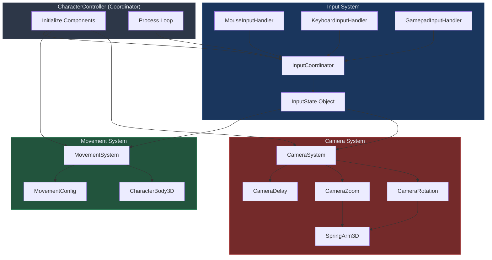

# Character Camera Controller (CCC) System - Overview

## Purpose

The CCC system provides a complete third-person character control solution designed for responsive, physics-based gameplay. It balances arcade-style responsiveness with realistic momentum mechanics while maintaining clean separation between input handling, character movement, and camera behavior.

## Core Philosophy

**Modular by Design**: Each system operates independently through shared state objects rather than direct coupling. This enables isolated debugging, feature swapping, and clear dependency chains.

**Physics-Informed Responsiveness**: Movement uses hybrid mechanics blending input-driven rotation with velocity-influenced momentum. At low speeds, character rotation follows input directly; at high speeds, rotation influence decreases while velocity maintains direction, creating natural-feeling momentum.

**Velocity-Driven Camera**: Camera tracking follows actual character velocity rather than input direction. This ensures proper framing during physics interactions (knockback, moving platforms, slopes) where input and movement diverge.

**Configuration-First**: All tunable parameters live in dedicated Resource objects, enabling designer-friendly iteration without code changes.

## System Architecture

## Component Hierarchy

**CharacterController** (Root Coordinator)
- Owns CharacterBody3D
- Initializes all subsystems
- Orchestrates update loop
- Provides public API for external systems

**InputCoordinator** (Input System Entry)
- Aggregates multiple input handlers
- Produces unified InputState each frame
- Manages device switching
- Handles mouse capture state

**MovementSystem** (Movement Logic)
- Processes InputState into movement
- Manages hybrid rotation/velocity mechanics
- Applies physics (gravity, jump, momentum)
- Exposes debug data

**CameraSystem** (Camera Coordinator)
- Processes InputState for camera control
- Delegates to modular components
- Manages SpringArm3D configuration
- Provides camera space utilities

## Data Flow

### Frame Update Cycle

1. **Input Aggregation**
   - InputCoordinator polls all handlers
   - Handlers update shared InputState
   - State includes movement, look, jump, modifiers

2. **Movement Processing**
   - MovementSystem receives InputState
   - Calculates hybrid rotation + velocity
   - Applies to CharacterBody3D
   - Executes move_and_slide()

3. **Camera Processing**
   - CameraSystem receives InputState
   - Updates position via CameraDelay
   - Updates rotation via CameraRotation
   - Updates zoom via CameraZoom

4. **Cleanup**
   - InputCoordinator clears frame-specific data
   - Systems prepare for next frame

### State Objects

**InputState** - Single frame of user input
- Movement vector (Vector2)
- Look delta (Vector2)
- Jump/sprint/walk flags (bool)
- Input source tracking (enum)
- Navigation data (if enabled)

**MovementConfig** - Movement tuning parameters
- Speed tiers (walk/run/sprint)
- Physics values (gravity, acceleration)
- Rotation behavior (speed-dependent turning)
- Momentum influence curves

**InputConfig** - Input device settings
- Mouse/gamepad sensitivity
- Deadzone thresholds
- Smoothing factors
- Inversion flags

## Key Design Patterns

### Coordinator Pattern
CharacterController acts as coordinator, not controller. It owns components but doesn't implement logic. Each subsystem handles its domain independently.

### Shared State Communication
Systems communicate through InputState rather than direct calls. This prevents coupling and enables clear data flow visualization.

### Configuration Resources
All tunable parameters exist as Godot Resources. Designers modify `.tres` files rather than code. Systems validate configurations at runtime.

### Component Composition
CameraSystem doesn't implement delay/zoom/rotation - it coordinates three separate components. Each component is independently testable and swappable.

## Critical Implementation Details

### Collision Layers
- **Layer 1**: Environment geometry
- **Layer 2**: Character collider
- **SpringArm3D**: Uses mask=1 (only hits environment)
- **CharacterBody3D**: Uses layer=2, mask=1

**Why This Matters**: SpringArm collision detection must ignore character collider or camera snaps to character center during movement.

### Scene vs Script Priority
Properties set in `.tscn` files override values assigned in `_ready()`. When debugging mismatched collision layers or configurations, check scene file first.

### Velocity-Based Camera Lead
CameraDelay uses character velocity magnitude/direction to position lead target ahead of character. This creates natural framing during acceleration/deceleration without input-based prediction errors.

### Rotation Influence Mechanics
At low speeds: Character rotation follows input direction directly.
At high speeds: Rotation influence increases, blending input direction with current facing direction. This preserves momentum while allowing gradual direction changes.

**Formula**: `influence = curve((speed - threshold) / (max_speed - threshold)) * max_influence`

### Jump Buffering & Coyote Time
- **Coyote Time**: Grace period after leaving ground where jump still executes
- **Jump Buffer**: Input window before landing where jump request persists
- Both prevent "missed" jumps from timing precision issues

## System Responsibilities

### Input System
- Device detection and switching
- Raw input to normalized values
- Mouse capture management
- Deadzone application
- Sensitivity scaling

### Movement System
- Camera-relative input conversion
- Hybrid rotation calculation
- Velocity-based movement
- Ground/air state management
- Jump mechanics
- Debug data exposure

### Camera System
- Target tracking with configurable delay
- Collision-aware distance adjustment
- Player-controlled rotation
- Zoom management
- Camera space calculations

## Extension Points

### Adding New Input Devices
1. Create new handler extending RefCounted
2. Implement `process_input(event, input_state)`
3. Register in InputCoordinator._ready()
4. Add configuration to InputConfig

### Adding Movement Modes
1. Create new MovementConfig resource
2. Add state tracking to MovementSystem
3. Implement mode-specific logic in process_movement()
4. Expose toggle via InputState

### Camera Behavior Customization
1. Create new component extending Node
2. Add initialization in CameraSystem.setup_systems()
3. Call update in CameraSystem.process_camera()
4. Export configuration parameters

## Common Pitfalls

**Modifying Velocity After move_and_slide()**
CharacterBody3D.velocity changes after slide calculation. Always read post-slide velocity: `current_velocity = character_body.velocity`

**Forgetting Frame Data Cleanup**
InputState accumulates look_delta and jump_pressed each frame. Must clear in InputCoordinator.process_input_reactions() or values persist.

**Camera Collision Mask Errors**
If camera snaps during movement, verify SpringArm3D.collision_mask excludes character layer.

**Rotation in Radians vs Degrees**
Godot uses radians internally. Always convert for designer-facing values: `rad_to_deg()` / `deg_to_rad()`

**Input Source Detection Failures**
Set `input_state.current_input_source` in EVERY input handler update. Missing assignments break device-specific scaling.

## Performance Characteristics

**Input Processing**: O(1) per handler per frame
**Movement Calculation**: O(1) vector operations
**Camera Updates**: O(1) smoothing calculations
**Physics Interactions**: Handled by CharacterBody3D (engine-level)

System runs efficiently in _process() rather than _physics_process() because movement uses move_and_slide() which handles timing internally. Camera smoothing benefits from higher frame rate updates.

## Testing Approach

**Unit Level**: Test individual components (CameraDelay, MovementConfig calculations)
**Integration Level**: Test system pairs (InputCoordinator → MovementSystem)
**System Level**: Test full CCC behavior in test scene
**Debugging**: Use MovementDebugVisualizer for real-time vector visualization

## Next Steps

For detailed implementation of each system, refer to:
- [Input System Documentation](input-system.md)
- [Movement System Documentation](movement-system.md)
- [Camera System Documentation](camera-system.md)